

  
  &nbsp;
  
  &nbsp;
  <a href="https://github.com/pablozr">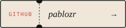</a>

 

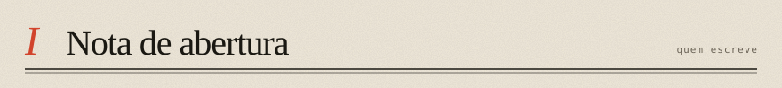

Curso Sistemas de Informação na UNIRIO e hoje sou estagiário de desenvolvimento na **Bagaggio**, onde mais de 200 lojas dependem de ferramentas que eu desenvolvi ou ainda mantenho. Antes disso passei por freelance com Next.js e por jogos educativos na própria universidade.

> *O que me interessa de verdade é o que acontece quando dá errado:* duas requisições chegando juntas no último item do estoque, um worker morrendo no meio do processamento, um agente de código mexendo em arquivo que ninguém pediu.

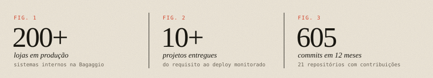

 

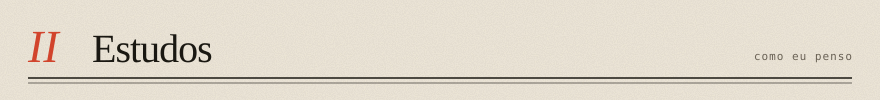

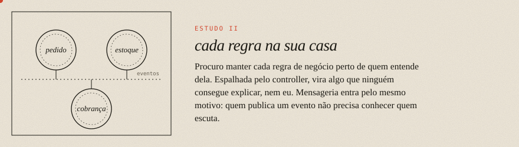

 

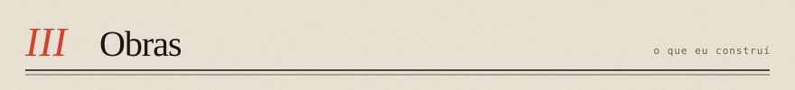

<a href="https://github.com/pablozr/JevGuard">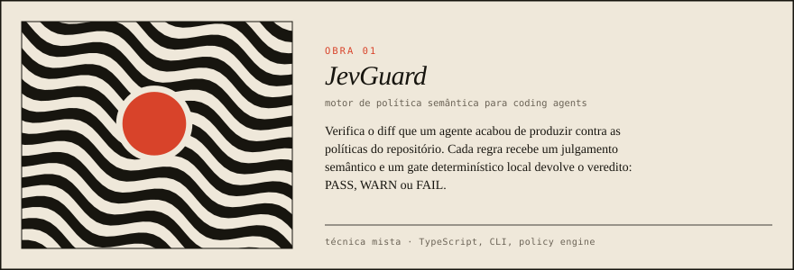</a>

<a href="https://github.com/pablozr/PRISMA">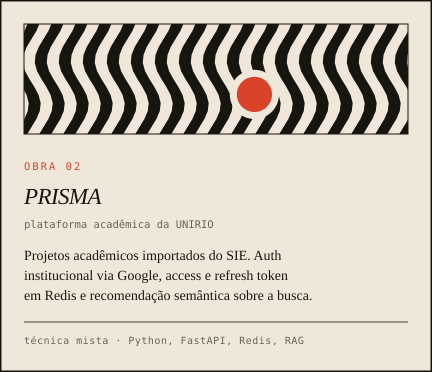</a>
<a href="https://github.com/pablozr/self-checkout-monolith">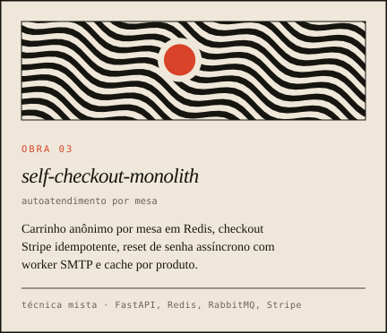</a>

<a href="https://github.com/pablozr/subscription-monolith">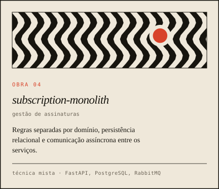</a>
<a href="https://github.com/pablozr/FastAPI-Template">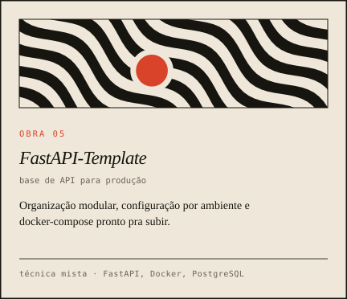</a>

 

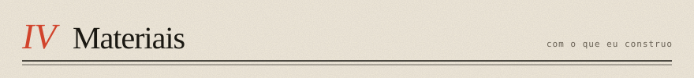

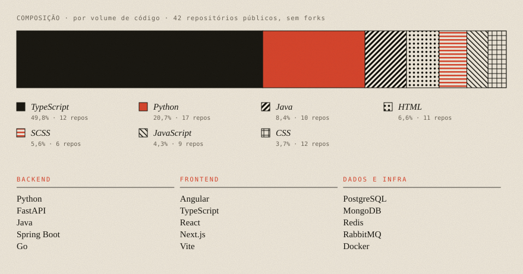

<i>Anexo: também no currículo</i>

 

- Frontend: JavaScript, React 19, Next.js 15, Server Actions, Phaser
- Infra e integração: APIs RESTful, integração com ERP, WebRTC, SSO
- Qualidade: testes unitários com Bun, documentação técnica
- Idiomas: português nativo, inglês C1
- Formação: UNIRIO, Bacharelado em Sistemas de Informação (2023–2027)
- Liderança: bolsista de extensão do Clube de Xadrez da UNIRIO, organizei torneios internos
- Também no perfil: [angular-template](https://github.com/pablozr/angular-template), base Angular por features

 

assets gerados por <code>scripts/gen_assets.py</code>

