 

&nbsp;&nbsp;

&nbsp;&nbsp;

 

## Sobre

Desenvolvedor backend em **[FastAPI](https://fastapi.tiangolo.com)**, com **[Angular](https://angular.dev)** no front. Trabalho em sistemas internos que precisam aguentar concorrência real — não é teoria, e sim fila, lock distribuído e transação explícita.

Hoje entrego sistemas na **Bagaggio**, onde mais de **200 lojas** dependem de ferramentas que já desenvolvi ou mantenho. Antes disso: freelance, jogos educativos com Phaser na UNIRIO, e Java/Spring Boot em legado.

Interesso também pelo lado que ninguém vê: **JevGuard**, um motor de política semântica para coding agents — impedir que um agente altere código além do que a tarefa pede. E o **TCC (PRISMA)**, na UNIRIO, que adiciona recomendación semântica sobre busca por palavras-chave.

 

 

## Como penso

- **Concorrência é invariante, não detalhe.** Toda operação crítica precisa de resposta explícita para o que acontece quando duas requisições chegam juntas.
- **Assíncrono por padrão.** Desacoplamento via mensageria (`RabbitMQ`) e `Redis` pub/sub, com estado explícito.
- **Regras de negócio explícitas.** Arquitetura orientada a domínio para que a regra viva no domínio, não espalhada no controller.
- **Agentes são um problema de engenharia.** Não confio no diff como está; verifico política por regra.

 

## Projetos

<table>
<tr>
<td colspan="2" valign="top">

<h4><a href="https://github.com/pablozr/JevGuard">JevGuard</a> — motor de política semântica para coding agents</h4>

Não é um gerador de código nem um reviewer de prosa. Verifica o diff que um agente acabou de produzir contra as políticas que importam no repositório: cada regra recebe um julgamento semântico via Jev, e um gate determinístico local retorna <code>PASS</code>, <code>WARN</code> ou <code>FAIL</code>.

 

</td>
</tr>
<tr>
<td valign="top" width="50%">

<h4><a href="https://github.com/pablozr/PRISMA">PRISMA</a></h4>

Plataforma da UNIRIO que centraliza projetos acadêmicos importados do SIE. Autenticação institucional via Google, sessões com access + refresh token em Redis, e camada de recomendación semântica sobre busca por palavras-chave.

 

</td>
<td valign="top" width="50%">

<h4><a href="https://github.com/pablozr/self-checkout-monolith">self-checkout-monolith</a></h4>

Fluxo completo de autoatendimento: carrinho anônimo por mesa em Redis, checkout Stripe com idempotência, reset de senha assíncrono via RabbitMQ + worker SMTP, e catálogo com cache por produto.

 

</td>
</tr>
<tr>
<td valign="top" width="50%">

<h4><a href="https://github.com/pablozr/subscription-monolith">subscription-monolith</a></h4>

Gestão de assinaturas com regras por domínio, persistência relacional e comunicação assíncrona.

 

</td>
<td valign="top" width="50%">

<h4><a href="https://github.com/pablozr/FastAPI-Template">FastAPI-Template</a></h4>

Template de API em padrão de produção: organização modular, configuração por ambiente, docker-compose e saída de onde eu costumo partir.

 

</td>
</tr>
<tr>
<td colspan="2" valign="top">

<h4><a href="https://github.com/pablozr/angular-template">angular-template</a></h4>

Base Angular por features, componentização reutilizável e estrutura pronta para integração com APIs REST.

</td>
</tr>
</table>

 

## Stack

 

<h4>Backend</h4>

  
  
  
  
  

<h4>Frontend</h4>

  
  
  
  
  

<h4>Dados, mensageria e infra</h4>

  
  
  
  
  

 

<b>Também no currículo</b>

- **Frontend:** JavaScript, React 19, Next.js 15, Server Actions, Phaser
- **Infra e integração:** APIs RESTful, integração com ERP, WebRTC, SSO
- **Qualidade:** testes unitários com Bun, documentação técnica
- **Idiomas:** português (nativo), inglês (C1)
- **Formação:** UNIRIO — Bacharelado em Sistemas de Informação (2023–2027)
- **Liderança:** bolsista de extensão do Clube de Xadrez da UNIRIO; organizou torneios internos

 

 

  Feito sem gerador externo — os SVGs desta página são meus e estão no repositório.

