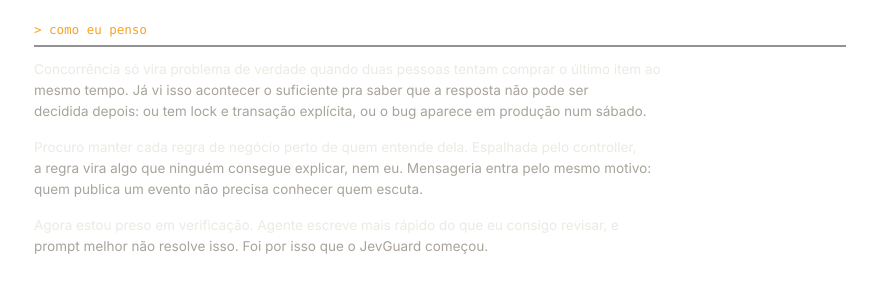
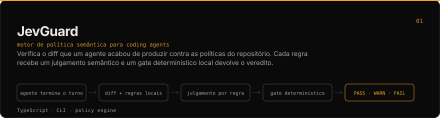
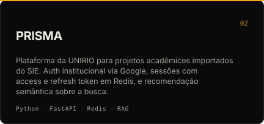
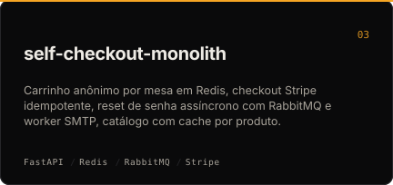
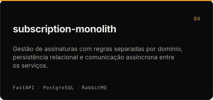
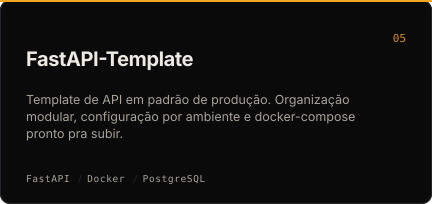

 

&nbsp;

&nbsp;

Curso Sistemas de Informação na UNIRIO e hoje sou estagiário de desenvolvimento na **Bagaggio**, onde mais de 200 lojas dependem de ferramentas que eu desenvolvi ou ainda mantenho. Antes disso passei por freelance com Next.js e por jogos educativos na própria universidade.

O que me interessa de verdade é o que acontece quando dá errado: duas requisições chegando juntas no último item do estoque, um worker morrendo no meio do processamento, um agente de código mexendo em arquivo que ninguém pediu.

## Projetos

<table>
<tr>
<td width="50%" valign="top"></td>
<td width="50%" valign="top"></td>
</tr>
<tr>
<td width="50%" valign="top"></td>
<td width="50%" valign="top"></td>
</tr>
</table>

## Stack

 

<h4>Backend</h4>

  
  
  
  
  

<h4>Frontend</h4>

  
  
  
  
  

<h4>Dados, mensageria e infra</h4>

  
  
  
  
  

Também no currículo

- Frontend: JavaScript, React 19, Next.js 15, Server Actions, Phaser
- Infra e integração: APIs RESTful, integração com ERP, WebRTC, SSO
- Qualidade: testes unitários com Bun, documentação técnica
- Idiomas: português nativo, inglês C1
- Formação: UNIRIO, Bacharelado em Sistemas de Informação (2023–2027)
- Liderança: bolsista de extensão do Clube de Xadrez da UNIRIO, organizei torneios internos
- Também no perfil: [angular-template](https://github.com/pablozr/angular-template), base Angular por features

