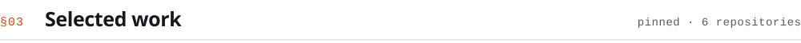
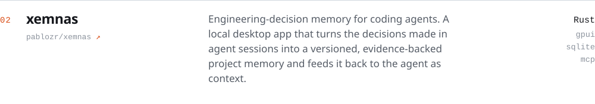
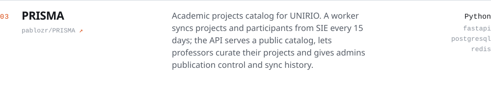
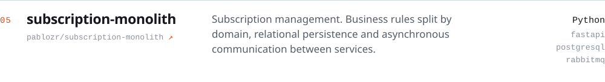
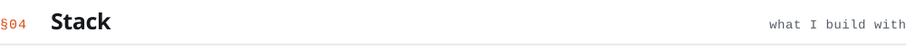
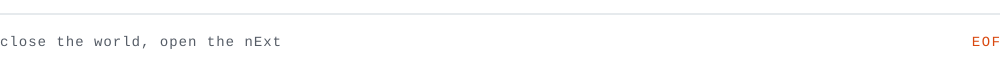

<picture><source media="(prefers-color-scheme: dark)" srcset="assets/header-dark.svg"></picture>

  <a href="https://www.linkedin.com/in/pablo-de-araujo-farina-893a8126b"><picture><source media="(prefers-color-scheme: dark)" srcset="assets/contact/linkedin-dark.svg"></picture></a>
  <a href="mailto:pablo.farina28@outlook.com"><picture><source media="(prefers-color-scheme: dark)" srcset="assets/contact/email-dark.svg"></picture></a>
  <a href="https://github.com/pablozr"><picture><source media="(prefers-color-scheme: dark)" srcset="assets/contact/github-dark.svg"></picture></a>

 

<picture><source media="(prefers-color-scheme: dark)" srcset="assets/sections/about-dark.svg"></picture>

I study Information Systems at UNIRIO and work as a software development intern at **Bagaggio**, where 200+ stores rely on tools I built or still maintain. Before that, I freelanced with Next.js and built educational games at the university.

What really interests me is what happens when things go wrong: two requests racing for the last item in stock, a worker dying mid-job, a coding agent editing a file nobody asked it to touch.

 

<picture><source media="(prefers-color-scheme: dark)" srcset="assets/sections/principles-dark.svg"></picture>

<picture><source media="(prefers-color-scheme: dark)" srcset="assets/principles-dark.svg"></picture>

 

<picture><source media="(prefers-color-scheme: dark)" srcset="assets/sections/work-dark.svg"></picture>

<a href="https://github.com/pablozr/JevGuard"><picture><source media="(prefers-color-scheme: dark)" srcset="assets/projects/jevguard-dark.svg"></picture></a> 
<a href="https://github.com/pablozr/xemnas"><picture><source media="(prefers-color-scheme: dark)" srcset="assets/projects/xemnas-dark.svg"></picture></a> 
<a href="https://github.com/pablozr/PRISMA"><picture><source media="(prefers-color-scheme: dark)" srcset="assets/projects/prisma-dark.svg"></picture></a> 
<a href="https://github.com/pablozr/self-checkout-monolith"><picture><source media="(prefers-color-scheme: dark)" srcset="assets/projects/self-checkout-dark.svg"></picture></a> 
<a href="https://github.com/pablozr/subscription-monolith"><picture><source media="(prefers-color-scheme: dark)" srcset="assets/projects/subscription-dark.svg"></picture></a> 
<a href="https://github.com/pablozr/FastAPI-Template"><picture><source media="(prefers-color-scheme: dark)" srcset="assets/projects/fastapi-template-dark.svg"></picture></a> 

Also on my profile: [angular-template](https://github.com/pablozr/angular-template), a feature-based Angular starter.

 

<picture><source media="(prefers-color-scheme: dark)" srcset="assets/sections/stack-dark.svg"></picture>

<picture><source media="(prefers-color-scheme: dark)" srcset="assets/stack-dark.svg"></picture>

 

<picture><source media="(prefers-color-scheme: dark)" srcset="assets/sections/education-dark.svg"></picture>

- **B.S. in Information Systems**, UNIRIO, 2023–2027
- **Languages:** Portuguese (native), English (C1)
- **Leadership:** extension scholar at the UNIRIO Chess Club, where I organized internal tournaments

<picture><source media="(prefers-color-scheme: dark)" srcset="assets/footer-dark.svg"></picture>
